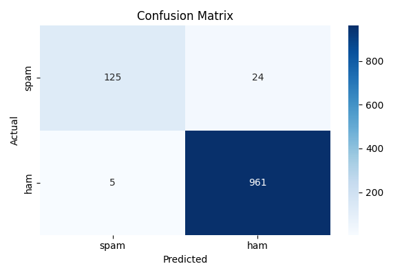

# 📱 SMS Spam Classification — ML Assignment

**Student:** Shaked Sabag | **ID (last 4):** 2142  
**Course:** Machine Learning  
**Dataset:** [SMS Spam Collection — Kaggle](https://www.kaggle.com/datasets/uciml/sms-spam-collection-dataset)  
**Submission Deadline:** 24.05.2026

---

## 📋 Project Overview

A complete supervised machine learning pipeline for **binary text classification** — detecting spam SMS messages using the SMS Spam Collection dataset (5,572 messages).

The project covers the full ML workflow: data loading, feature engineering, model training, evaluation, hyperparameter optimization, and model explainability.

---

## 🤖 AI Tools Used

| Tool | Query |
|---|---|
| Perplexity AI | "explain TF-IDF vectorization for spam detection" |
| Perplexity AI | "how to implement Naive Bayes classifier with sklearn" |

---

## 📁 Repository Structure

| File | Description |
|---|---|
| `spam_classification.ipynb` | Main notebook — all parts |
| `spam_data.csv` | Original dataset |
| `train.csv` | Training split (80%) |
| `test.csv` | Test split (20%) |
| `confusion_matrix.png` | Confusion matrix visualization |
| `errors.md` | SHAP warnings explanation |
| `README.md` | This file |


---

## 📦 Dataset

- **Source:** SMS Spam Collection (UCI / Kaggle)
- **Size:** 5,572 SMS messages
- **Labels:** `spam` (747, ~13%) / `ham` (4,825, ~87%)
- **Imbalance:** ~87% ham, ~13% spam — this is why F1 Score is used instead of accuracy

---

## ⚙️ Setup & Installation

### 1. Clone the repository
```bash
git clone https://github.com/YOUR_USERNAME/ml-spam-classification.git
cd ml-spam-classification
```

### 2. Create and activate Conda environment
```bash
conda create -n ml-assignment python=3.11
conda activate ml-assignment
```

### 3. Install dependencies
```bash
pip install pandas numpy matplotlib seaborn scikit-learn jupyter notebook shap ipywidgets
```

### 4. Launch Jupyter in VSCode
- Open the folder in VSCode
- Open `spam_classification.ipynb`
- Select kernel: `ml-assignment`
- Run: **Kernel → Restart & Run All Cells**

---

## 🧪 Notebook Structure

| Part | Description | Points |
|---|---|---|
| **Part 1** | Introduction, student details, dataset loading | 15 |
| **Part 2** | Feature Engineering — TF-IDF & Bag of Words | 30 |
| **Part 3** | Algorithm — Naive Bayes Classifier | 30 |
| **Part 4** | Training flow — 3 end-to-end examples | 10 |
| **Part 5** | Evaluation — F1 Score, confusion matrix | 10 |
| **Bonus** | Grid Search + K-Fold Cross Validation | +5 |
| **Bonus** | Feature Engineering Comparison | +20 |
| **Bonus** | SHAP Explainability | +10 |

---

## 📊 Results

### Model Performance

| Metric | Value |
|---|---|
| **F1 Score (spam)** | **0.9053** |
| Accuracy | 97% |
| Precision (spam) | 96% |
| Recall (spam) | 84% |

### Confusion Matrix



| | Predicted Spam | Predicted Ham |
|---|---|---|
| **Actual Spam** | ✅ 125 (True Positive) | ❌ 24 (False Negative) |
| **Actual Ham** | ❌ 5 (False Positive) | ✅ 961 (True Negative) |

### Grid Search — All Configurations

| Feature Method | Alpha | CV F1 Mean | CV F1 Std |
|---|---|---|---|
| **TF-IDF** | **0.5** | **0.9596** | **0.0090** |
| TF-IDF | 1.0 | 0.9591 | 0.0057 |
| TF-IDF | 0.1 | 0.9583 | 0.0098 |
| BoW | 2.0 | 0.9570 | 0.0103 |
| BoW | 0.1 | 0.9567 | 0.0079 |
| BoW | 1.0 | 0.9565 | 0.0103 |
| BoW | 0.5 | 0.9554 | 0.0096 |
| TF-IDF | 2.0 | 0.9442 | 0.0082 |

🏆 **Best configuration: TF-IDF + Alpha=0.5 → Final Test F1 = 0.9053**

---

## 🧠 Algorithm — Naive Bayes

Multinomial Naive Bayes applies Bayes' theorem with the assumption that all features (words) are conditionally independent given the class label:
P(spam | words) ∝ P(words | spam) × P(spam)


- **Prior P(spam):** proportion of spam in training data (~13%)
- **Likelihood P(word | spam):** word frequency in spam messages
- **Alpha (Laplace smoothing):** prevents zero probabilities for unseen words

---

## 🔍 Feature Engineering

| Method | Description | Test F1 |
|---|---|---|
| **TF-IDF** | Weights words by frequency × inverse document frequency | **0.9053** |
| Bag of Words | Raw word counts | ~0.90 |

TF-IDF outperforms BoW because it down-weights common words that appear across all messages, allowing the model to focus on discriminative spam vocabulary.

---

## 💡 SHAP Explainability

We use `shap.KernelExplainer` (model-agnostic) to explain which words drive spam predictions. `LinearExplainer` is not compatible with `MultinomialNB` since it is not a linear model.

The SHAP summary plot reveals that top spam indicators include words such as: **free, won, prize, call, claim, txt, cash, urgent** — consistent with human intuition about spam language patterns.

> ⚠️ Two non-critical warnings appear during SHAP execution due to high-dimensional sparse TF-IDF vectors. These do not affect the results. See [`errors.md`](errors.md) for a full explanation.

---

## 📝 Key Conclusions

- **TF-IDF outperforms BoW** — down-weighting common words focuses the model on genuinely discriminative vocabulary
- **Alpha=0.5 is optimal** — the default 1.0 over-smooths word probabilities slightly
- **F1 = 0.905** means 9 out of 10 spam messages are correctly detected, with only 5 false alarms out of 966 ham messages
- **SHAP confirms** the model learned meaningful features aligned with human understanding of spam language

---

## 🎥 Video Walkthrough

> 📺 [Watch on YouTube](https://www.youtube.com/watch?v=YOUR_VIDEO_ID)